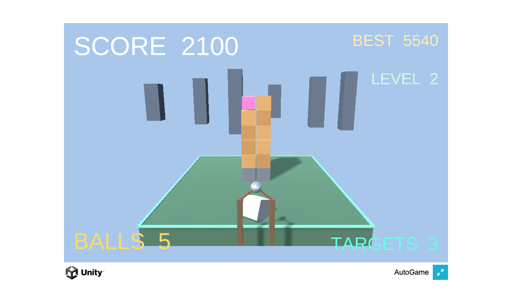

# 🎯 SLING SMASH

> 引いて放つだけ。弧を描くボールでタワーを崩す、3Dスリングショット破壊アクション。

ボールを引っ張って放ち、弧を描く軌道でタワーを倒し、光るクリスタルのターゲットを破壊する 3D スリングショット破壊ゲームです。ワンタッチで狙いを定められ、発射前にはリアルタイムの軌道プレビューが表示されます。Unity 製の WebGL ビルドで、ブラウザから直接プレイできます。


🔗 **[Live Demo](https://masafykun.github.io/sling-smash/)**

---

## 📸 スクリーンショット


---

## 🎮 操作方法
| 操作 | 動作 |
|---|---|
| ドラッグして引く | 発射の方向と威力を調整 |
| ドラッグ中 | 軌道プレビューを表示 |
| 放す | ボールを弧を描いて発射 |

---

## ✨ 特徴
- **スリングショット破壊** — 引いて放ち、弧を描くボールでタワーを崩す
- **ワンタッチ照準** — ドラッグ＆リリースのシンプル操作
- **軌道プレビュー** — 発射前にリアルタイムで弾道を可視化
- **クリスタルターゲット** — 光るクリスタルを破壊してクリア

---

## 🛠️ 技術スタック
| カテゴリ | 技術 |
|---|---|
| ゲームエンジン | Unity 6000.0.77f1 |
| 言語 | C#（`src/` 配下） |
| ビルド | WebGL |
| 配信 | GitHub Pages |

---

## 🚀 セットアップ

```bash
# WebGL ビルドはブラウザで直接プレイ可能
# Live Demo: https://masafykun.github.io/sling-smash/

# ローカルで動かす場合（CORS 回避のため簡易サーバー経由で開く）
python3 -m http.server 8000
# ブラウザで http://localhost:8000/ を開く
```

C# ソースは `src/` ディレクトリにあります。Unity（6000.0.77f1）でプロジェクトとして開けます。

---

## ライセンス

[](https://opensource.org/licenses/MIT)

このプロジェクトは **MIT ライセンス** のもとで公開しています。

© 2026 masafykun (https://github.com/masafykun)
